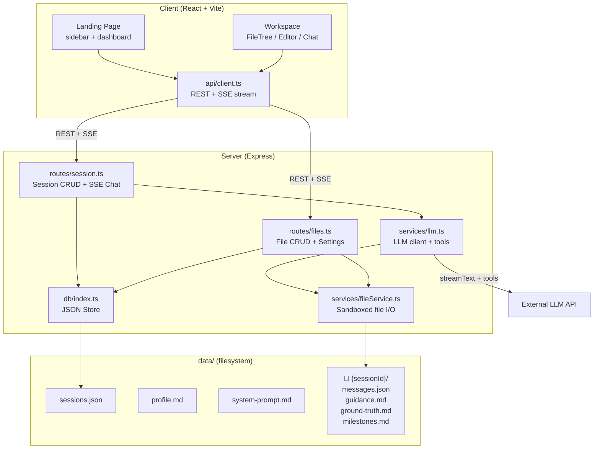
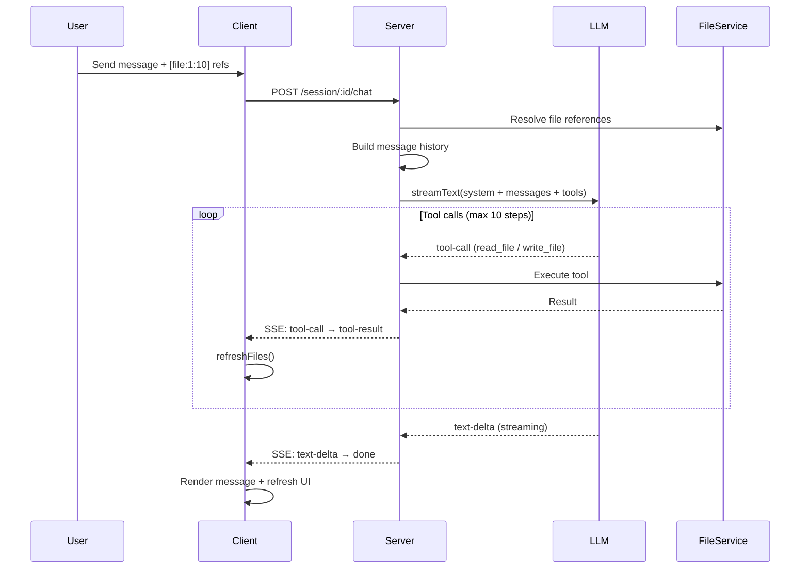
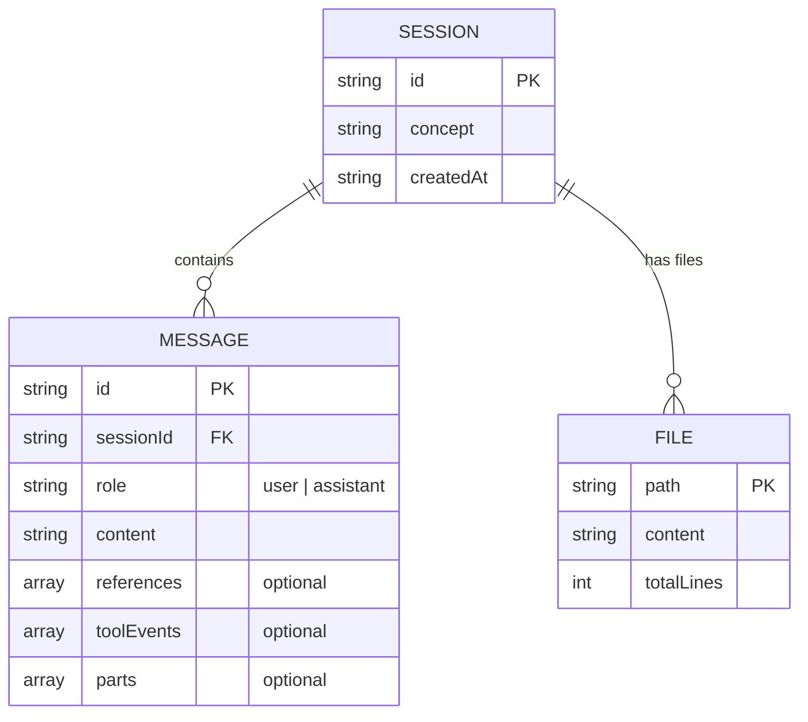
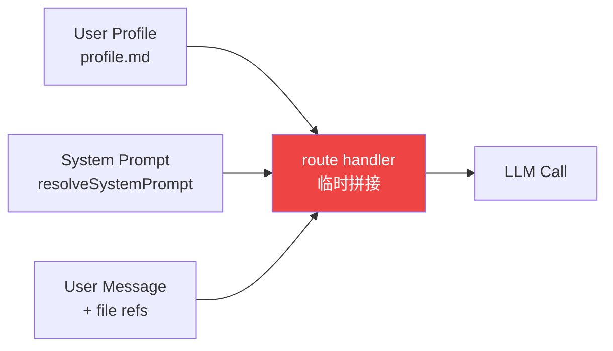
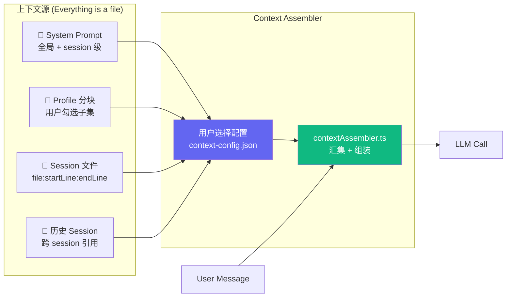
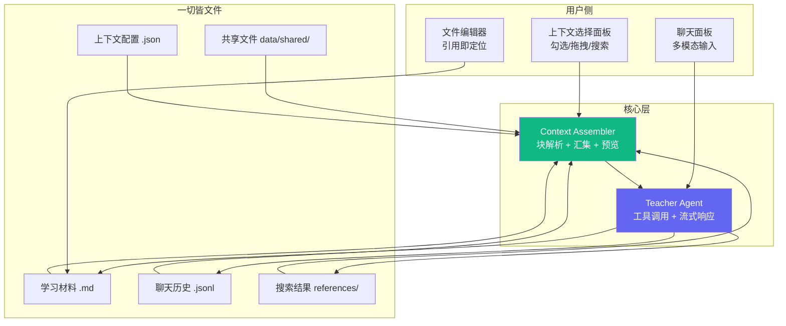

# Architecture

## What This Is

Teacher Agent Notebook — AI 教学工具。Teacher Agent 生成结构化学习材料并通过聊天辅导学生。三栏 UI：文件树 | 编辑器 | 聊天。

**核心愿景：上下文编排器 (Context Orchestrator)** — 让用户自由选择、编辑、组合传给 LLM 的上下文。一切皆文件。

## Tech Stack

| Layer | Stack |
|-------|-------|
| Client | React 19 · Vite 6 · Tailwind 4 · react-markdown |
| Server | Express 5 · Vercel AI SDK v6 · @ai-sdk/openai |
| LLM | OpenAI-compatible API (DashScope / OpenAI / etc.) |
| Storage | JSON files + Markdown files (no database) |
| Monorepo | npm workspaces · TypeScript strict · ES2022 |

## System Overview



## Chat Data Flow



## Data Model



**Session 保持薄** — `{ id, concept, createdAt }` 三个字段，永不膨胀。所有丰富度来自 session 目录下的文件：

```
data/{sessionId}/
├── messages.json       # 聊天历史
├── guidance.md         # Teacher 生成的教学指南
├── ground-truth.md     # 知识文档
├── milestones.md       # 学习进度 (- [x] / - [ ])
├── session-prompt.md   # session 级教学指令（追加到全局 prompt）
└── ...                 # 任意文件，everything is a file
```

## Design Principles

| Principle | Implementation |
|-----------|---------------|
| **Everything is a file** | 学习材料、profile、prompt、未来的聊天历史都是可编辑文件 |
| **Agent 解耦** | `toolEvents`/`parts` 为可选字段。无 LLM 时退化为纯笔记工具 |
| **沙箱安全** | FileService 路径遍历防护，所有操作限制在 session 目录内 |
| **流式优先** | 全程 SSE，客户端实时渲染文本增量和工具事件 |
| **Thin handles, rich files** | Session 对象是目录指针，文件是内容，不往 Session 塞字段 |

## API Endpoints

| Method | Path | Purpose |
|--------|------|---------|
| GET | `/api/session` | List sessions |
| POST | `/api/session` | Create session |
| GET | `/api/session/:id` | Get session + messages |
| POST | `/api/session/:id/chat` | SSE streaming chat |
| GET | `/api/session/:id/milestones` | Milestone progress |
| GET | `/api/:sid/files` | List session files |
| GET | `/api/:sid/file?path=` | Read file |
| PUT | `/api/:sid/file` | Write file |
| DELETE | `/api/:sid/file?path=` | Delete file |
| GET/PUT | `/api/profile` | User profile |
| GET/PUT | `/api/system-prompt` | Custom system prompt |
| GET | `/api/llm-status` | LLM config status |

---

## Architecture Evolution

### Current: Direct Assembly

上下文在路由层临时拼接，用户不可见、不可选。



### Next: Context Assembler

引入 **Context Assembler** — 用户可见的上下文选择中间层。



**关键变化：**
- 用户主动勾选哪些文件/块参与对话
- 选择配置存为 `data/{sessionId}/context-config.json`（everything is a file）
- `GET /api/session/:id/context-preview` 可预览 LLM 即将看到的完整上下文
- 第一步：Profile 分块选择 → 验证链路 → 扩展到其他源

### Future: Full Orchestration



**演进路线：**

```
Phase 1 — 基础编排
  ✅ System Prompt 文件化 + 运行时读取
  → Session 级教学指令（追加到 prompt）
  → Profile 分块 + 选择性注入
  → Context Assembler 核心框架

Phase 2 — 可见的上下文
  → 上下文预览面板（模型看到了什么）
  → 文件段落级选择 UI
  → 跨 session 文件引用

Phase 3 — 完整编排
  → 聊天历史文件化 + Fork
  → 多模态输入（图片/视觉）
  → Agent 联网搜索 → 结果自动归档为文件
  → 全局共享文件区
```
