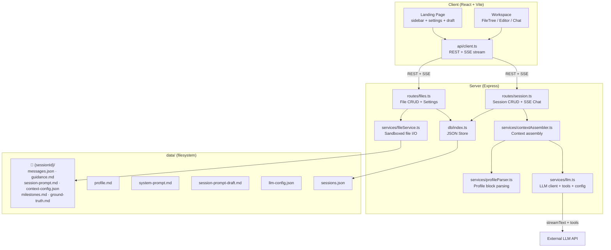
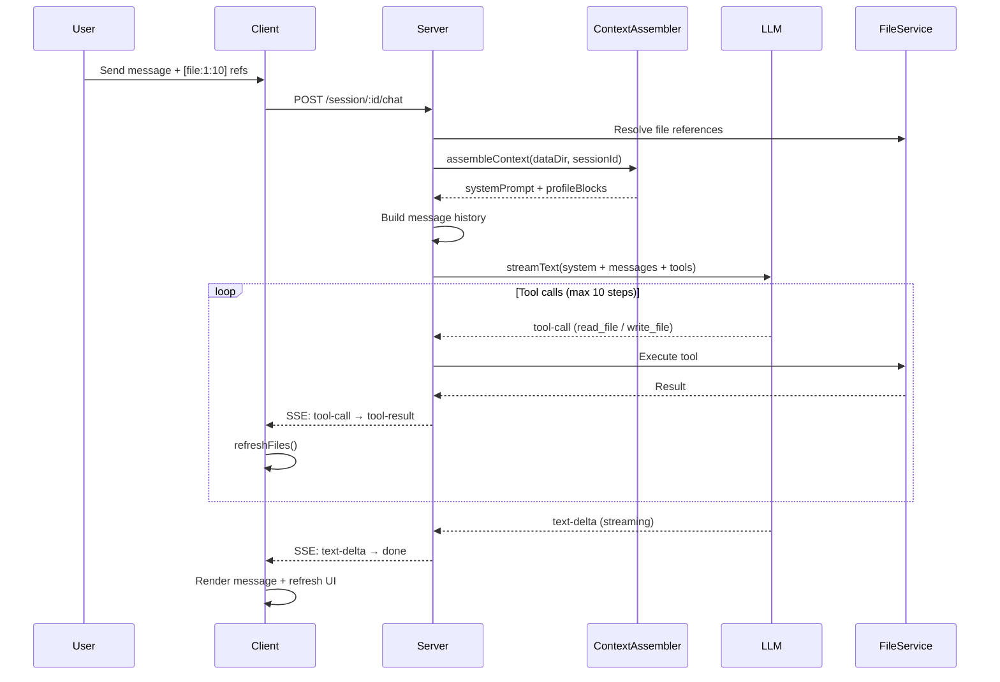
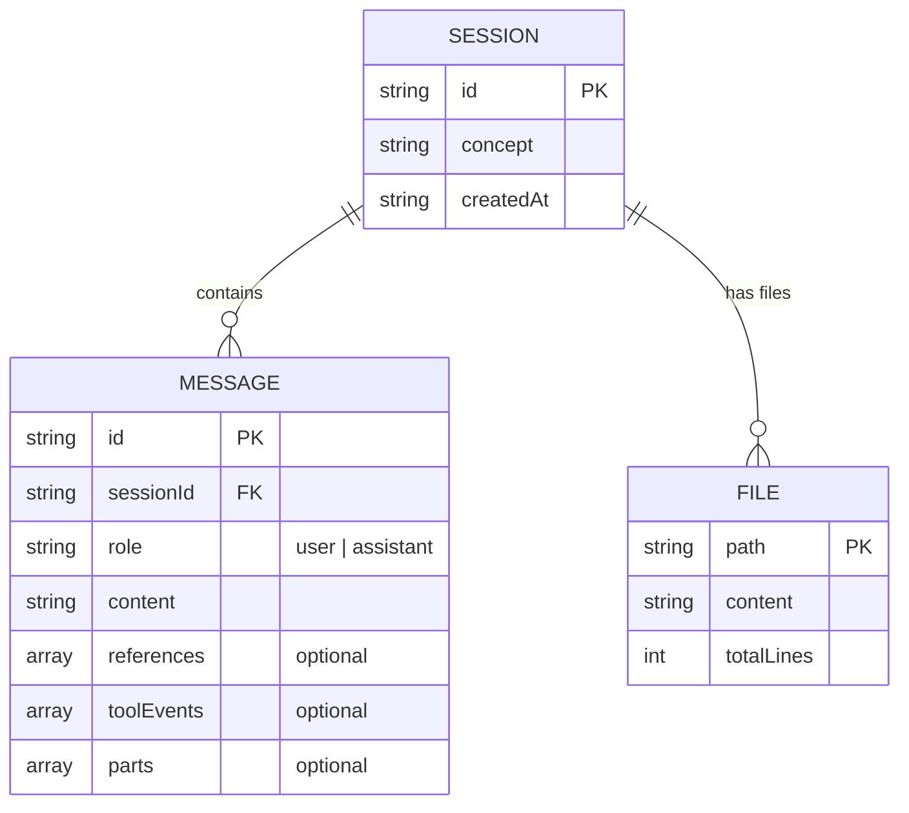
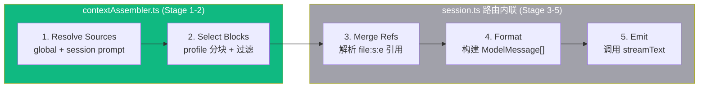

# Architecture

## What This Is

Teacher Agent Notebook — AI 教学工具。Teacher Agent 生成结构化学习材料并通过聊天辅导学生。三栏 UI：文件树 | 编辑器 | 聊天。

**核心愿景：上下文编排器 (Context Orchestrator)** — 让用户自由选择、编辑、组合传给 LLM 的上下文。一切皆文件。

## Tech Stack

| Layer | Stack |
|-------|-------|
| Client | React 19 · Vite 6 · Tailwind 4 · react-markdown · react-syntax-highlighter |
| Server | Express 5 · Vercel AI SDK v6 · @ai-sdk/openai |
| LLM | OpenAI-compatible API (DashScope / OpenAI / etc.)，运行时可切换 |
| Storage | JSON files + Markdown files (no database) |
| Testing | vitest · supertest · jsdom · @testing-library/react · 150 tests |
| Monorepo | npm workspaces · TypeScript strict · ES2022 |

## System Overview



## Chat Data Flow



## Data Model



**Session 保持薄** — `{ id, concept, createdAt }` 三个字段，永不膨胀。所有丰富度来自 session 目录下的文件：

```
data/
├── profile.md                  # 用户档案（按 # 标题分块）
├── system-prompt.md            # 全局系统提示词
├── session-prompt-draft.md     # 教学指令草稿（新 session 自动复制）
├── llm-config.json             # LLM 运行时配置（env fallback）
├── sessions.json               # session 索引
│
└── {sessionId}/
    ├── messages.json            # 聊天历史
    ├── session-prompt.md        # session 级教学指令（追加到 prompt）
    ├── context-config.json      # 上下文选择配置
    ├── guidance.md              # Teacher 教学指南
    ├── ground-truth.md          # 知识文档
    ├── milestones.md            # 学习进度 (- [x] / - [ ])
    └── ...                      # 任意文件
```

## Design Principles

| Principle | Implementation |
|-----------|---------------|
| **Everything is a file** | 学习材料、profile、prompt、config 都是可编辑文件 |
| **Agent 解耦** | `toolEvents`/`parts` 为可选字段。无 LLM 时退化为纯笔记工具 |
| **沙箱安全** | FileService 路径遍历防护，所有操作限制在 session 目录内 |
| **流式优先** | 全程 SSE，客户端实时渲染文本增量和工具事件 |
| **Thin handles, rich files** | Session 是目录指针，文件是内容，不往 Session 塞字段 |
| **运行时可配** | LLM config 存文件，运行时切换无需重启 |

## API Endpoints

| Method | Path | Purpose |
|--------|------|---------|
| GET | `/api/session` | List sessions |
| POST | `/api/session` | Create session（自动复制 draft → session-prompt） |
| GET | `/api/session/:id` | Get session + messages |
| POST | `/api/session/:id/chat` | SSE streaming chat |
| GET | `/api/session/:id/milestones` | Milestone progress |
| GET | `/api/session/:id/context-preview` | Preview assembled context |
| PUT | `/api/session/:id/context-config` | Save context selection config |
| GET | `/api/:sid/files` | List session files |
| GET | `/api/:sid/file?path=` | Read file |
| PUT | `/api/:sid/file` | Write file |
| DELETE | `/api/:sid/file?path=` | Delete file |
| GET/PUT | `/api/profile` | User profile |
| GET | `/api/profile/blocks` | Parsed profile blocks |
| GET/PUT | `/api/system-prompt` | Custom system prompt |
| GET/PUT | `/api/session-prompt-draft` | Session prompt template |
| GET | `/api/llm-status` | LLM config status (read-only) |
| PUT | `/api/llm-config` | Update LLM config at runtime |

---

## Context Assembly (当前状态)

`contextAssembler.ts` 目前覆盖 DESIGN.md 5 阶段流水线的 Stage 1-2。Stage 3-5 仍在 `session.ts` 路由内联。



**下一步**：将 Stage 3-5 从路由中提取到 assembler/compiler，使路由变成薄胶水层。详见 DESIGN.md。

---

## Architecture Evolution

```
Phase 1 — 基础编排 ✅
  ✅ System Prompt 文件化 + session 级追加
  ✅ Session prompt draft 模板 → 新 session 自动复制
  ✅ LLM 运行时配置切换
  ✅ Profile 分块解析 + 选择性注入
  ✅ Context Assembler 核心 (Stage 1-2)
  ✅ Session 标题自动摘要

Phase 2 — 可见的上下文 (next)
  → Context Assembler 完整化 (Stage 3-5 提取)
  → 上下文预览面板 UI（模型看到了什么）
  → Profile 块选择接入 context-config
  → 跨 session 文件引用

Phase 3 — 完整编排
  → Part Accumulator 共享提取
  → 聊天历史文件化 + Fork
  → 多模态输入（图片/视觉）
  → Agent 联网搜索 → 结果归档为文件
```
