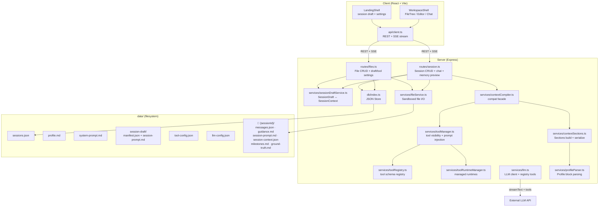
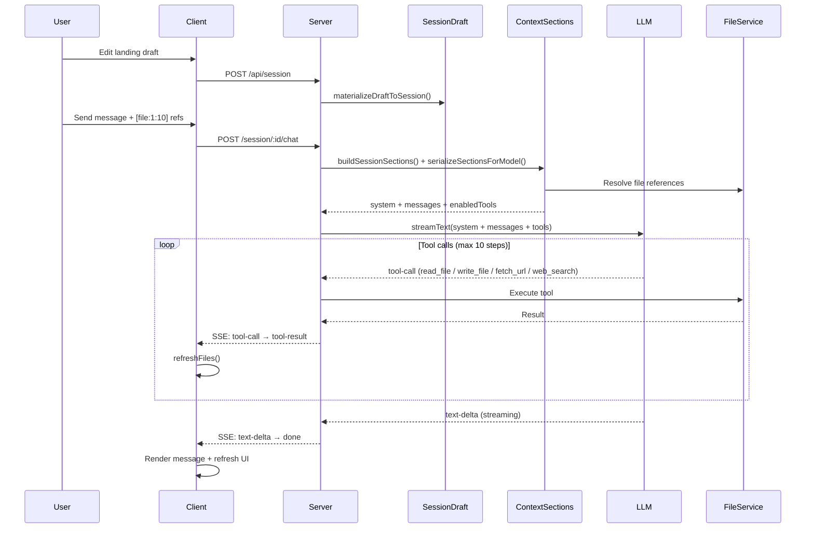
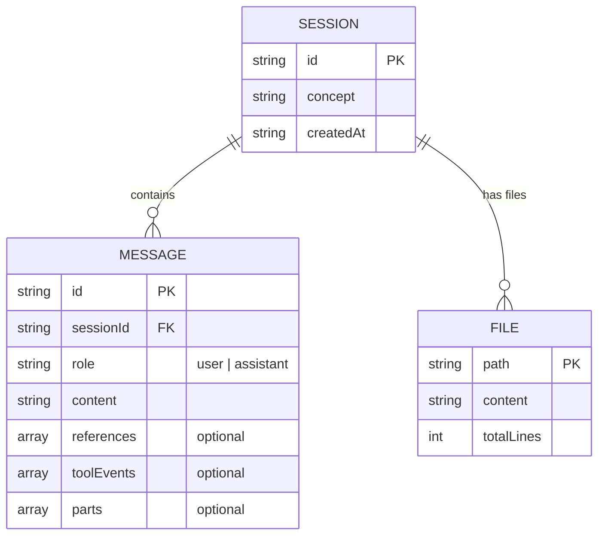
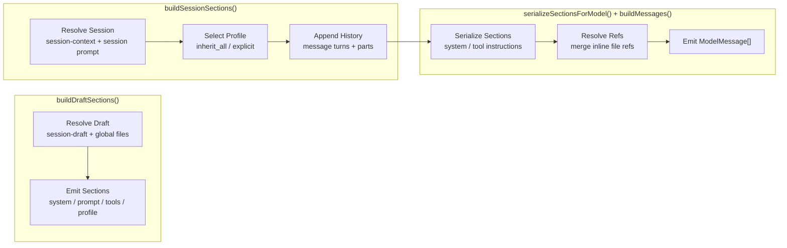

# Architecture

## What This Is

Teacher Agent Notebook — AI 教学工具。Teacher Agent 生成结构化学习材料并通过聊天辅导学生。三栏 UI：文件树 | 编辑器 | 聊天。

**核心愿景：上下文编排器 (Context Orchestrator)** — 让用户自由选择、编辑、组合传给 LLM 的上下文。一切皆文件。

## Tech Stack

| Layer | Stack |
|-------|-------|
| Client | React 19 · Vite 6 · Tailwind 4 · react-markdown · react-syntax-highlighter |
| Server | Express 5 · Vercel AI SDK v6 · @ai-sdk/openai |
| LLM | OpenAI-compatible API (DashScope / OpenAI / etc.)，运行时可切换 |
| Storage | JSON files + Markdown files (no database) |
| Testing | vitest · supertest · jsdom · @testing-library/react |
| Monorepo | npm workspaces · TypeScript strict · ES2022 |

## System Overview


```mermaid
graph TB
    subgraph Client ["Client (React + Vite)"]
        LP[LandingShell<br/>session draft + settings]
        WS[WorkspaceShell<br/>FileTree / Editor / Chat]
        API[api/client.ts<br/>REST + SSE stream]
    end

    subgraph Server ["Server (Express)"]
        SR[routes/session.ts<br/>Session CRUD + chat + memory preview]
        FR[routes/files.ts<br/>File CRUD + draft/tool settings]
        SDS[services/sessionDraftService.ts<br/>SessionDraft ↔ SessionContext]
        CS[services/contextSections.ts<br/>Sections build + serialize]
        CC[services/contextCompiler.ts<br/>compat facade]
        TM[services/toolManager.ts<br/>tool visibility + prompt injection]
        TR[services/toolRegistry.ts<br/>tool schema registry]
        RT[services/toolRuntimeManager.ts<br/>managed runtimes]
        LLM[services/llm.ts<br/>LLM client + registry tools]
        PP[services/profileParser.ts<br/>Profile block parsing]
        FS[services/fileService.ts<br/>Sandboxed file I/O]
        ST[db/index.ts<br/>JSON Store]
    end

    subgraph Data ["data/ (filesystem)"]
        SJ[sessions.json]
        PM[profile.md]
        SP[system-prompt.md]
        TD["session-draft/<br/>manifest.json + session-prompt.md"]
        TC[tool-config.json]
        LC[llm-config.json]
        SD["📁 {sessionId}/<br/>messages.json · guidance.md<br/>session-prompt.md · session-context.json<br/>milestones.md · ground-truth.md"]
    end

    LP & WS --> API
    API -- "REST + SSE" --> SR & FR
    FR --> SDS
    SR --> SDS
    SR --> CC --> CS
    CC --> TM --> TR
    TM --> RT
    CS --> PP
    SR & FR --> ST --> SJ
    FR --> FS
    SR --> FS
    FS --> SD
    LLM -- "streamText + tools" --> EXT["External LLM API"]
```

## Chat Data Flow


```mermaid
sequenceDiagram
    participant U as User
    participant C as Client
    participant S as Server
    participant SD as SessionDraft
    participant CC as ContextSections
    participant L as LLM
    participant F as FileService

    U->>C: Edit landing draft
    C->>S: POST /api/session
    S->>SD: materializeDraftToSession()
    U->>C: Send message + [file:1:10] refs
    C->>S: POST /session/:id/chat
    S->>CC: buildSessionSections() + serializeSectionsForModel()
    CC->>F: Resolve file references
    CC-->>S: system + messages + enabledTools
    S->>L: streamText(system + messages + tools)

    loop Tool calls (max 10 steps)
        L-->>S: tool-call (read_file / write_file / fetch_url / web_search)
        S->>F: Execute tool
        F-->>S: Result
        S-->>C: SSE: tool-call → tool-result
        C->>C: refreshFiles()
    end

    L-->>S: text-delta (streaming)
    S-->>C: SSE: text-delta → done
    C->>C: Render message + refresh UI
```

## Data Model


```mermaid
erDiagram
    SESSION ||--o{ MESSAGE : contains
    SESSION ||--o{ FILE : "has files"
    SESSION {
        string id PK
        string concept
        string createdAt
    }
    MESSAGE {
        string id PK
        string sessionId FK
        string role "user | assistant"
        string content
        array references "optional"
        array toolEvents "optional"
        array parts "optional"
    }
    FILE {
        string path PK
        string content
        int totalLines
    }
```

**Session 保持薄** — `{ id, concept, createdAt }` 三个字段，永不膨胀。Landing Page 的“下一次 Session”状态单独存在 `session-draft/`，已创建 Session 的丰富度来自 session 目录下的文件：

```
data/
├── profile.md                  # 用户档案（按 # 标题分块）
├── system-prompt.md            # 全局系统提示词
├── session-draft/
│   ├── manifest.json           # 下一次新 Session 的上下文与工具选择
│   └── session-prompt.md       # 下一次新 Session 的教学指令
├── tool-config.json            # 全局工具 runtime/provider 配置
├── llm-config.json             # LLM 运行时配置（env fallback）
├── sessions.json               # session 索引
│
└── {sessionId}/
    ├── messages.json            # 聊天历史
    ├── session-prompt.md        # session 级教学指令（追加到 prompt）
    ├── session-context.json     # 已物化的上下文与工具选择快照
    ├── guidance.md              # Teacher 教学指南
    ├── ground-truth.md          # 知识文档
    ├── milestones.md            # 学习进度 (- [x] / - [ ])
    └── ...                      # 任意文件
```

## Design Principles

| Principle | Implementation |
|-----------|---------------|
| **Everything is a file** | 学习材料、profile、prompt、config 都是可编辑文件 |
| **Agent 解耦** | `toolEvents`/`parts` 为可选字段。无 LLM 时退化为纯笔记工具 |
| **沙箱安全** | FileService 路径遍历防护，所有操作限制在 session 目录内 |
| **流式优先** | 全程 SSE，客户端实时渲染文本增量和工具事件 |
| **Thin handles, rich files** | Session 是目录指针，文件是内容，不往 Session 塞字段 |
| **运行时可配** | LLM config 存文件，运行时切换无需重启 |

## API Endpoints

| Method | Path | Purpose |
|--------|------|---------|
| GET | `/api/session` | List sessions |
| POST | `/api/session` | Create session（自动复制 draft → session-prompt） |
| GET | `/api/session/:id` | Get session + recent message page |
| GET | `/api/session/:id/messages` | Load older chat history by cursor |
| POST | `/api/session/:id/chat` | SSE streaming chat |
| GET | `/api/session/:id/milestones` | Milestone progress |
| GET | `/api/context-preview/template` | Preview landing draft context |
| GET | `/api/session/:id/context-memory` | Preview current session memory |
| GET | `/api/session/:id/context-preview` | Legacy compatibility preview |
| PUT | `/api/session/:id/context-config` | Save context selection config |
| GET/PUT | `/api/session-draft` | Landing Page draft state |
| GET | `/api/:sid/files` | List session files |
| GET | `/api/:sid/file?path=` | Read file |
| PUT | `/api/:sid/file` | Write file |
| DELETE | `/api/:sid/file?path=` | Delete file |
| GET/PUT | `/api/profile` | User profile |
| GET | `/api/profile/blocks` | Parsed profile blocks |
| GET/PUT | `/api/system-prompt` | Custom system prompt |
| GET/PUT | `/api/tools/:id` | Global tool runtime config |
| POST | `/api/tools/:id/runtime/:action` | Tool runtime start/check/restart/stop |
| GET/PUT | `/api/session/:id/tools` | Session-level tool visibility |
| GET | `/api/llm-status` | LLM config status (read-only) |
| PUT | `/api/llm-config` | Update LLM config at runtime |

---

## Context Assembly (当前状态)

当前主线已经从“扁平 assemble + compile”收敛到 `ContextSection[]`：

- `ContextSectionsService.buildDraftSections()`：Landing Page 的上下文预览
- `ContextSectionsService.buildSessionSections()`：Session 内的模型记忆与真实注入源
- `ContextSectionsService.serializeSectionsForModel()`：把 sections 序列化成模型 system string
- `contextCompiler.ts`：只保留兼容 facade，方便旧接口和旧测试继续工作


```mermaid
graph LR
    subgraph Draft ["buildDraftSections()"]
        D1["Resolve Draft<br/>session-draft + global files"]
        D2["Emit Sections<br/>system / prompt / tools / profile"]
    end

    subgraph Session ["buildSessionSections()"]
        S1["Resolve Session<br/>session-context + session prompt"]
        S2["Select Profile<br/>inherit_all / explicit"]
        S3["Append History<br/>message turns + parts"]
    end

    subgraph Compile ["serializeSectionsForModel() + buildMessages()"]
        C1["Serialize Sections<br/>system / tool instructions"]
        C2["Resolve Refs<br/>merge inline file refs"]
        C3["Emit ModelMessage[]"]
    end

    D1 --> D2
    S1 --> S2 --> S3 --> C1 --> C2 --> C3
```

这让 draft preview、session memory 和真实模型注入共享同一套选择规则，不再分别维护三份逻辑。

---

## Architecture Evolution

```
Phase 1 — 基础编排 ✅
  ✅ System Prompt 文件化 + session 级追加
  ✅ Session prompt draft 模板 → 新 session 自动复制
  ✅ LLM 运行时配置切换
  ✅ Profile 分块解析 + 选择性注入
  ✅ Context Compiler 完整聊天流水线 (Stage 1-5)
  ✅ Session 标题自动摘要
  ✅ 长聊天历史分页 + 虚拟列表

Phase 2 — 可见的上下文 ✅
  ✅ 上下文预览面板 UI
  ✅ Session 内模型记忆展示
  ✅ Landing Draft 与 SessionContext 语义分离
  ✅ Tool Manager 接入上下文编排

Phase 3 — 完整编排 (next)
  → 继续清理兼容层（旧 preview / context-config / search-config）
  → 聊天历史文件化 + Fork
  → 多模态输入（图片/视觉）
  → 更完整的可管理工具栈
```
